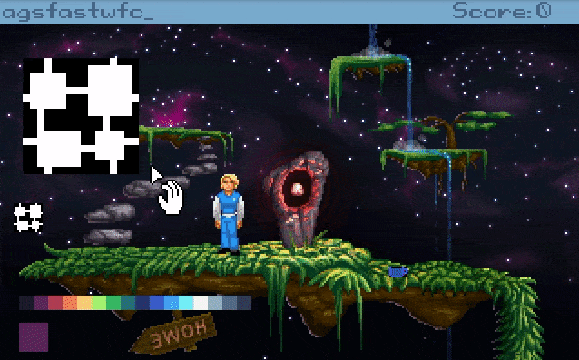
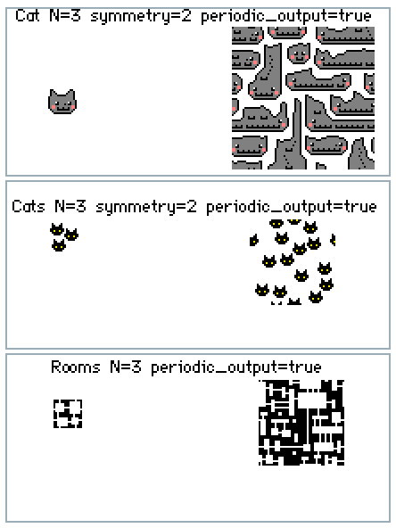

# agsfastwfc

🚨THIS IS VERY EXPERIMENTAL🚨 | [](https://dev.azure.com/ericoporto/agsfastwfc/_build/latest?definitionId=7&branchName=master)

**AGS Fast Wave Function Collapse Plugin**



Using the [fast-wfc library code](https://github.com/math-fehr/fast-wfc) from Mathieu Fehr and Nathanaël Courant. I just made a simple interface with Adventure Game Studio. Read more on [Wafe Function Collapse here](https://github.com/mxgmn/WaveFunctionCollapse).

## AgsFastWFC Script API usage

agsfastwfc can generate sprites that are locally similar to the input bitmap.

### Overlapping


```
bool AgsFastWFC.Overlapping(
                   int destination, int sprite,
				   int seed,
				   bool periodic_input, bool periodic_output,
				   int N=3, int ground=0)
```
- **`int destination`** The Graphic property of a Dynamic Sprite you have created to draw the result.
- **`int sprite`** The source sprite you want to feed FastWFC Overlapping algorithm.
- **`int seed`** An integer number, will provide the randomness of the output.
- **`bool periodic_input`** Should be true if the input is periodic.
- **`bool periodic_output`** Should be true if the desired output is periodic.
- **`int N`** A NxN pattern of pixels in the output should occur at least once in the input. Default is 3x3 pixels.
- **`int ground`** Default is 0.

Example:

```
  dynspr_dest = DynamicSprite.Create(60, 120, true);  
  int result = AgsFastWFC.Overlapping(
					dynspr_dest.Graphic, obj_source.Graphic,
					Random(100000),
					true, true, 3,  0);
  obj_destination.Graphic = dynspr_dest.Graphic;
```

## Building agsfastwfc plugin

first you need to clone this repository to the folder you clone your repos (ex: ~/git).

If you haven't already, also clone AGS and set the branch for ags3.

```
git clone https://github.com/ericoporto/agsfastwfc.git
git clone https://github.com/adventuregamestudio/ags.git
pushd ags
git checkout ags3
popd
```

### Windows

Just load the solution on Visual Studio 2019 or 2017, and hit build.

### Linux

You need gcc that supports C++17. Load a terminal and do the below after cloning.

```
cd agsfastwfc/agsfastwfc/
make
```

### MacOS

MacOS build is untested, but should work the same way as Linux.

## Image samples



The image samples come from [https://github.com/mxgmn/WaveFunctionCollapse](https://github.com/mxgmn/WaveFunctionCollapse)

## Licence

This plugin interface is made with MIT License Copyright (c) 2019 Érico Vieira Porto.

fast-wfc Copyright (c) 2018-2019 Mathieu Fehr and Nathanaël Courant.

MIT License, see [`LICENSE`](LICENSE) for further details.
